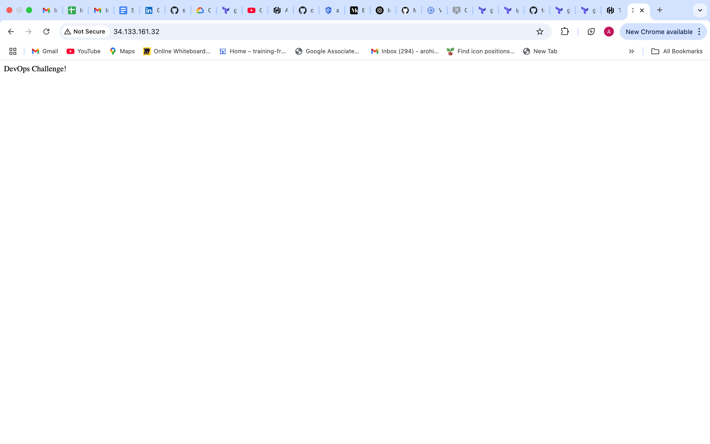

# DevOps Challenge – Terraform Infrastructure Deployment 

This repository contains Terraform scripts to automate the provisioning of infrastructure on Google Cloud Platform (GCP). The objective is to deploy a simple web application using Compute Engine. Additionally, a Terraform script is provided to automate the scaling of the deployment.

---

## What This Terraform Script Does

- Provisions a Google Compute Engine VM instance
- Installs necessary dependencies (e.g., Python, Git) and launches the Flask app on startup
- Sets up firewall rules to allow HTTP and SSH traffic
- Sets up alerting policies and uptime checks to continuously monitor and ensure resource health and availability.
- The bonus challenge includes managed instance groups with autoscaling enabled to automatically scale the number of instances up or down based on traffic demand.

---

## Technologies Used
- Terraform ~> v1.3+
- GitHub Actions

---

##  Prerequisites

- GCP account and project
- Enabled Compute Engine API
- Terraform CLI installed locally
- Create a service account with proper permission to authenticate Github Actions to Cloud Platform. 
- Grant appropriate IAM roles to the service account, including Service Account Token Creator and any additional roles required for the resources being provisioned. In this use case, the service account has been assigned the following roles: Compute Instance Admin, Compute Network Admin, and Monitoring Editor.
- Download the service account key in JSON format and securely add it as a secret (e.g., GCP_CREDENTIALS) in your GitHub repository under Settings → Secrets and variables → Actions.

---

## Deployment Steps
- After completing the prerequisite steps, I provisioned a Compute Engine instance that hosts a simple Flask application. The Python dependencies and application code are executed through a startup script defined in the Terraform configuration.
- The instance is an E2-medium VM based on the Ubuntu image, offering a balance of performance and cost-effectiveness.
- To enhance security, the instance is launched within a custom VPC network with properly configured firewall rules. The script includes a dynamic allow block, enabling developers to define multiple rules that control access based on source IPs, ports, and traffic types.
- The instance is assigned an internal IP from its subnet and also has external access enabled through the access_config {} block, allowing the application to be reached publicly.
- Monitoring and alerting are configured using Google Cloud’s Monitoring resources. Uptime checks and alerting policies have been created to ensure continuous health and availability tracking of the deployed instance.
- Currently, only the /terraform directory has been deployed, which sets up the base infrastructure and application.
- For enhanced scalability and high availability, users can navigate to the /bonus directory and execute the Terraform scripts there, which include managed instance groups with autoscaling.
- Once the script is pushed to GitHub, GitHub Actions is automatically triggered. The CI/CD pipeline is configured to run whenever a commit is pushed to the main branch, executing the Terraform scripts located in the /terraform directory.
- Upon successful execution of the GitHub Actions workflow, the following output confirms the pipeline ran 
successfully. Check the assets folder to see the expected output.
- The services are deployed to Google Cloud Platform (GCP), and the Flask application running on the Compute Engine instance can be accessed via the browser using: http://<EXTERNAL_IP>:80. The expected application output appears as shown below: 

---

## Input Variables

| Name | Description | Type |
|------|-------------|------|
| name | The name of the resource | string |
| machine_type | The machine type to create | string |
| zone | The zone that the machine should be created in | string |
| image | The image from which to initialize the boot disk | string |
| ip_cidr_range | The range of internal addresses that are owned by this subnetwork | string |
| region | The GCP region for this subnetwork | string |
| source_ranges | If source ranges are specified, the firewall will apply only to traffic that has source IP address in these ranges | list(string) |
| startup_script | The startup script | string |
| allow | The list of ALLOW rules specified by this firewall | any |
| conditions | A list of conditions for the alert policy. The conditions are combined by AND or OR according to the combiner field | any |
| combiner | How to combine the results of multiple conditions to determine if an incident should be opened | string |
| timeout | The maximum amount of time to wait for the request to complete | string |
| period | How often, in seconds, the uptime check is performed | string |
| http_check | Contains information needed to make an HTTP or HTTPS check | any |